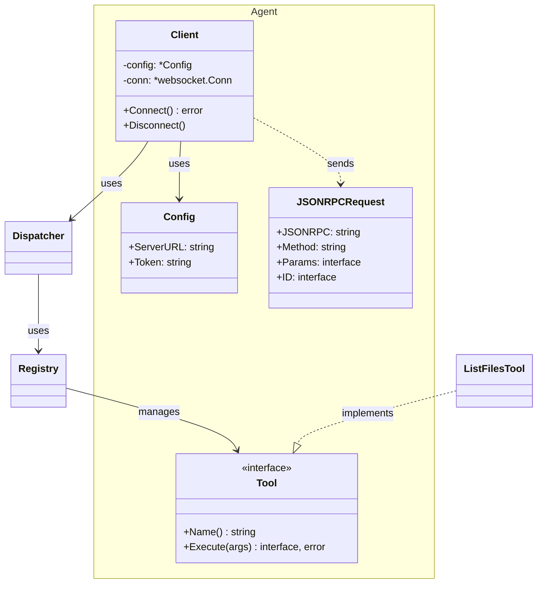

# FabriCore Agent Class Diagram

```mermaid
classDiagram
    namespace Agent {
        class Config {
            +ServerURL: string
            +Token: string
        }

        class Client {
            -config: *Config
            -conn: *websocket.Conn
            +Connect() error
            +Disconnect()
        }

        class Tool {
            <<interface>>
            +Name() string
            %% Changed interface{} to interface to avoid parsing errors
            +Execute(args) interface, error
        }

        class JSONRPCRequest {
            +JSONRPC: string
            +Method: string
            +Params: interface
            +ID: interface
        }
    }

    %% Relationships defined OUTSIDE the namespace block
    Client --> Config : uses
    Client ..> JSONRPCRequest : sends
    Client --> Dispatcher : uses
    Dispatcher --> Registry : uses
    Registry --> Tool : manages
    ListFilesTool ..|> Tool : implements
```
