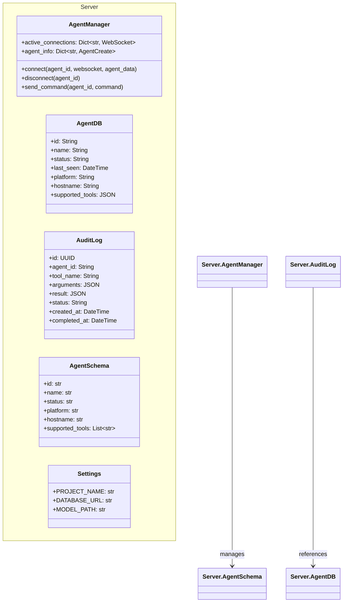

# FabriCore Server Class Diagram

```mermaid
classDiagram
    namespace Server {
        class AgentManager {
            +active_connections: Dict~str, WebSocket~
            +agent_info: Dict~str, AgentCreate~
            +connect(agent_id, websocket, agent_data)
            +disconnect(agent_id)
            +send_command(agent_id, command)
        }

        class AgentDB {
            +id: String
            +name: String
            +status: String
            +last_seen: DateTime
            +platform: String
            +hostname: String
            +supported_tools: JSON
        }

        class AuditLog {
            +id: UUID
            +agent_id: String
            +tool_name: String
            +arguments: JSON
            +result: JSON
            +status: String
            +created_at: DateTime
            +completed_at: DateTime
        }

        class AgentSchema {
            +id: str
            +name: str
            +status: str
            +platform: str
            +hostname: str
            +supported_tools: List~str~
        }

        class Settings {
            +PROJECT_NAME: str
            +DATABASE_URL: str
            +MODEL_PATH: str
        }
    }
    
    %% Relationships must be OUTSIDE the namespace block
    Server.AgentManager --> Server.AgentSchema : manages
    Server.AuditLog --> Server.AgentDB : references
```
